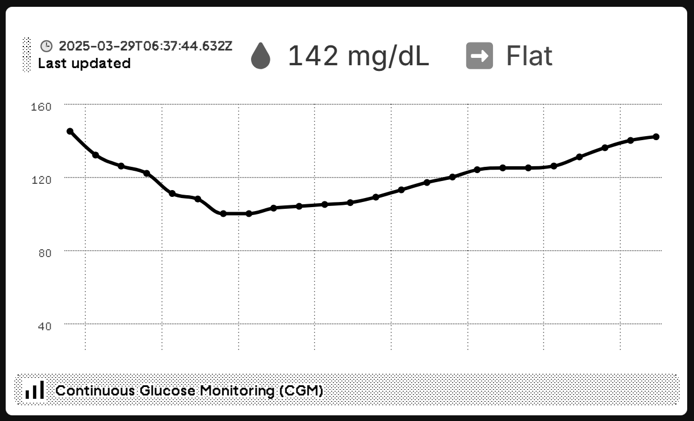

#  TRMNL Plugin - Dexcom G7 Continuous Glucose Monitoring (CGM) 🩸

This plugin displays real-time or mock Dexcom G7 glucose data in your [TRMNL](https://usetrmnl.com) dashboard using their **Custom Plugin API** and webhook strategy.

<p align="center">
  
</p>

It supports:
- 🔍 **Live Data Fetching** from a Nightscout server.
- 📊 **Dynamic Chart Rendering** using Highcharts and Chartkick.
- 🚦 **Trend Arrows** indicating glucose direction (e.g., Rising, Falling, Flat).
- 💡 **Mock Data Support** for offline testing and development.
- 🔒 **Secure API Communication** with API Key handling.

---

## 🛠️ Setup Instructions

### 1. Clone the Plugin

```bash
git clone https://github.com/YOUR_USERNAME/trmnl-plugin-dexcom-g7.git
cd trmnl-plugin-dexcom-g7
```

Install Python deps:

```bash
python3 -m venv venv
source venv/bin/activate   # On Windows: .\venv\Scripts\activate
pip install -r requirements.txt
```

---

### 2. Create the `.env` File

```bash
cp .env.example .env
```

Then update in the .env:

```
TRMNL_API_KEY=your_trmnl_api_key
TRMNL_PLUGIN_ID=your_plugin_id
NIGHTSCOUT_URL=https://your-nightscout-server-url
NIGHTSCOUT_API_SECRET=your_api_secret
USE_MOCK_DATA=true  # Set to true to use mock data, false for live data
```
---

### 3. Add the Dashboard Template

In your [TRMNL dashboard](https://usetrmnl.com):

1. Go to: **Plugins → Private Plugin → Your Plugin**
2. Paste contents of `template.html.liquid` into the **Markup** or **Template** field
3. Save

---

### 4. Send Data (Choose one)


```bash
python nightscout_to_trmnl.py
```

---


## 🔮 Future Features

- [ ]  Add Dexcom Share API integration.
- [ ] Add logging or status history in the dashboard template.

---

## 🧪 Development Mode

Keep `USE_MOCK_DATA=true` to develop without hitting the nightscout API.

---

## giuthub workflow setup
Go to your repository Settings > Secrets and variables > Actions > New secret and add the following secrets:

- TRMNL_API_KEY - Your TRMNL API Key
- TRMNL_PLUGIN_ID - Your TRMNL Plugin ID
- NIGHTSCOUT_URL - Your Nightscout URL (e.g., https://your-nightscout-server-url)
- NIGHTSCOUT_API_SECRET - Your Nightscout API Secret

### Trigger the Workflow
- The workflow will run automatically every 15 minutes.
- You can also trigger it manually from the Actions tab in your repository.

## 📄 License

MIT © 2025 Anand Singh
